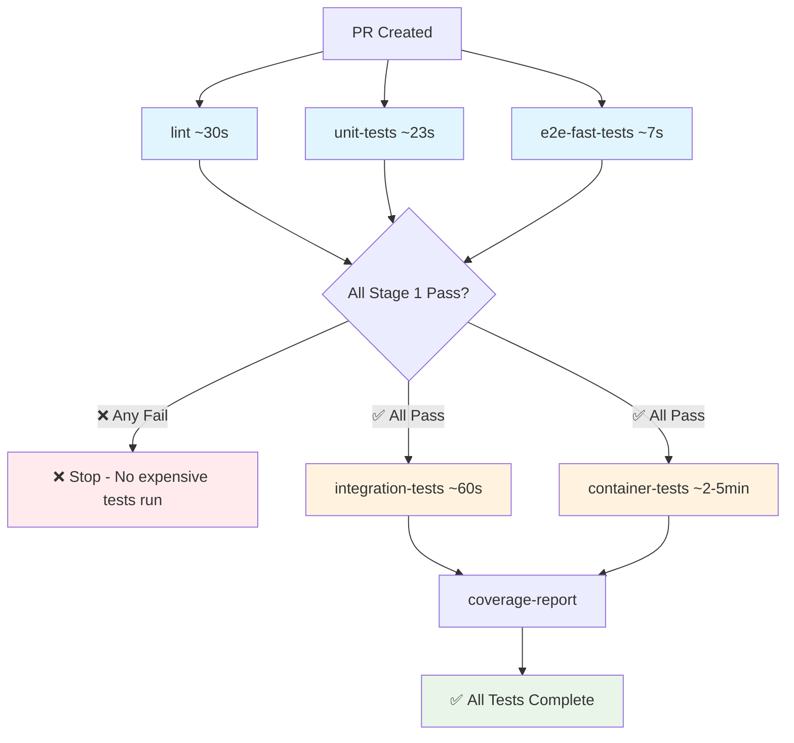

# Testing Strategy

This document outlines the comprehensive testing strategy for the MCP Troubleshoot Server, including when different test types run in CI and how to execute them locally.

## Testing Hierarchy

### 1. **Unit Tests** (`tests/unit/`)
**Purpose**: Test individual components in isolation  
**Speed**: Fast (~23 seconds)  
**CI**: Runs on every PR  
**Local**: `uv run pytest tests/unit/ -v`

- **Coverage**: Core business logic, component interfaces, error handling
- **Dependencies**: Mocked/stubbed external dependencies
- **Examples**: Bundle manager logic, file operations, kubectl command building

### 2. **Integration Tests** (`tests/integration/`)
**Purpose**: Test component interactions with real dependencies  
**Speed**: Medium (~30-60 seconds)  
**CI**: Runs on every PR  
**Local**: `uv run pytest tests/integration/ -v`

- **Coverage**: Database interactions, file system operations, subprocess calls
- **Dependencies**: Real sbctl binary, real file system, real processes
- **Examples**: Bundle loading, server lifecycle, multi-bundle scenarios

### 3. **E2E Tests - Direct Tool Integration** (`tests/e2e/test_direct_tool_integration.py`)
**Purpose**: Test MCP tools by calling them directly (bypasses subprocess issues)  
**Speed**: Fast (~7 seconds)  
**CI**: Runs on every PR  
**Local**: `uv run pytest tests/e2e/test_direct_tool_integration.py -v`

- **Coverage**: All 6 MCP tools working correctly
- **Dependencies**: Real bundle files, sbctl integration
- **Examples**: initialize_bundle, list_files, read_file, grep_files, kubectl

### 4. **E2E Tests - Container Validation** (`tests/e2e/test_container_bundle_validation.py`)
**Purpose**: Test production container with actual melange/apko build  
**Speed**: Slow (2-5 minutes)  
**CI**: ⚠️ **SKIPPED** - Must run locally before PR completion  
**Local**: **REQUIRED** - See [Container Testing](#container-testing) section

- **Coverage**: Production container functionality, bundle initialization in real environment
- **Dependencies**: Podman/Docker, melange/apko build process
- **Examples**: Container startup, bundle loading, complete workflow validation

## CI Pipeline Integration

### PR Checks (`.github/workflows/pr-checks.yaml`)

The CI pipeline is optimized to fail fast and avoid wasting resources:



**Key Benefits:**
- ⚡ **Fast Feedback**: Most issues caught in Stage 1 (~60 seconds)
- 💰 **Resource Efficient**: Expensive tests only run when basics pass
- 🎯 **Fail Fast**: No wasted CI time on broken fundamentals

#### **Stage 1 Jobs (Fast - Run in Parallel)**

**Job: `lint`** (~30 seconds)
- Code quality checks (ruff format, ruff check, mypy)
- Fails fast on formatting/style issues

**Job: `unit-tests`** (~23 seconds)  
```bash
# Runs: tests/unit/ with coverage
uv run pytest tests/unit/ --cov=src --cov-report=xml -v
```

**Job: `e2e-fast-tests`** (~7 seconds)
```bash
# Runs: Direct tool integration tests (all 6 MCP tools)
uv run pytest tests/e2e/test_direct_tool_integration.py -v
```

#### **Stage 2 Jobs (Slow - Only if Stage 1 Passes)**

**Job: `integration-tests`** (~60 seconds)
```bash
# Installs sbctl binary, runs: tests/integration/ with coverage  
uv run pytest tests/integration/ --cov=src --cov-report=xml -v
```

**Job: `container-tests`** (Skipped in CI)
```bash
# NOTE: Container tests are skipped in CI due to melange/apko limitations
# Developers MUST run these locally before marking tasks complete:
uv run pytest tests/e2e/ -m container -v
```

#### **Job: `coverage-report`**
- Combines coverage from unit and integration tests
- Uploads to Codecov

### Container Publishing (`.github/workflows/publish-container.yaml`)

Runs on version tags (e.g., `1.0.0`):

1. **Build**: Uses melange/apko to create production container
2. **Validate**: Tests that sbctl, kubectl, and MCP server work in container
3. **Publish**: Pushes to GitHub Container Registry

## Local Testing

### Quick Development Testing
```bash
# Fast feedback loop (< 1 minute total)
uv run pytest tests/unit/ -v                                    # ~23s
uv run pytest tests/e2e/test_direct_tool_integration.py -v      # ~7s  
```

### Comprehensive Testing
```bash
# Full test suite (< 3 minutes total)
uv run pytest tests/unit/ tests/integration/ -v                 # ~60s
uv run pytest tests/e2e/ -m "not container" -v                  # ~10s

# REQUIRED: Run slow tests locally before PR completion
uv run pytest -m slow -v                                       # ~2-5 minutes
```

### Container Testing

⚠️ **IMPORTANT**: Container tests are skipped in CI due to melange/apko container-in-container limitations. **You MUST run these tests locally before marking any task as complete or creating a PR.**

Container tests require the production image to be built first:

```bash
# 1. Build production container (one-time, ~2-3 minutes)
MELANGE_TEST_BUILD=true ./scripts/build.sh

# 2. Run container tests (~30-60 seconds) - REQUIRED before PR
uv run pytest tests/e2e/ -m container -v

# 3. Run all slow tests (includes container tests) - REQUIRED before PR
uv run pytest -m slow -v

# 4. Run specific container test
uv run pytest tests/e2e/test_container_bundle_validation.py::TestContainerBundleValidation::test_container_bundle_initialization -v
```

### Test Markers

Use pytest markers to run specific test categories:

```bash
# By test type
uv run pytest -m unit          # Unit tests only
uv run pytest -m integration   # Integration tests only  
uv run pytest -m e2e           # E2E tests only
uv run pytest -m container     # Container tests only

# By speed
uv run pytest -m "not slow"    # Exclude slow tests
uv run pytest -m slow          # Slow tests only

# Combined
uv run pytest -m "e2e and not container"  # Fast E2E tests only
```

## Testing Strategy Rationale

### Why This Hybrid Approach?

**Problem**: Traditional MCP E2E tests (subprocess within pytest) caused conflicts:
- Process management conflicts between pytest and MCP server
- Nested asyncio event loops causing hangs  
- Signal handler conflicts
- Environment setup differences

**Solution**: Multi-layered testing approach:

1. **Fast Direct Tool Tests**: Test all MCP functionality without subprocess conflicts
2. **Container Tests**: Validate production environment exactly as users experience it
3. **Comprehensive CI**: Every PR tests both development speed and production accuracy

### Benefits

✅ **Fast Development Feedback**: Direct tool tests complete in 7 seconds  
✅ **Production Confidence**: Container tests use actual melange/apko build  
✅ **No False Positives**: Eliminated subprocess-related test hangs  
✅ **Build Process Validation**: CI tests the complete container build pipeline  
✅ **Parallel Execution**: CI runs multiple test jobs simultaneously  

### Test Coverage Strategy

| Component | Unit Tests | Integration Tests | Direct E2E | Container E2E |
|-----------|------------|-------------------|------------|---------------|
| Bundle Manager | ✅ Logic | ✅ File I/O | ✅ Full Flow | ✅ Production |
| MCP Tools | ✅ Parsing | ✅ sbctl Integration | ✅ All 6 Tools | ✅ JSON-RPC |
| File Operations | ✅ Validation | ✅ Real Files | ✅ Bundle Context | ✅ Container FS |
| kubectl Integration | ✅ Commands | ✅ Process Exec | ✅ API Server | ✅ Container Env |
| Server Lifecycle | ✅ State | ✅ Startup/Shutdown | ✅ Direct Access | ✅ Protocol Layer |

## Troubleshooting Tests

### Common Issues

**Tests hang during bundle initialization**:
- This indicates subprocess/pytest conflicts
- Use direct tool tests instead: `uv run pytest tests/e2e/test_direct_tool_integration.py`

**Container tests fail with "image not found"**:
```bash
# Build the container first
MELANGE_TEST_BUILD=true ./scripts/build.sh
```

**Integration tests fail with "sbctl not found"**:
```bash  
# Install sbctl (automatic in CI)
curl -L -o /tmp/sbctl.tar.gz "https://github.com/replicatedhq/sbctl/releases/latest/download/sbctl_linux_amd64.tar.gz"
tar -xzf /tmp/sbctl.tar.gz -C /tmp
sudo mv /tmp/sbctl /usr/local/bin/
```

### Debugging Test Failures

**Enable verbose logging**:
```bash
uv run pytest tests/e2e/ -v -s --log-cli-level=DEBUG
```

**Run single test with full output**:
```bash
uv run pytest tests/e2e/test_direct_tool_integration.py::TestDirectToolIntegration::test_initialize_bundle_tool_direct -v -s
```

**Check container logs**:
```bash
# Run container interactively  
podman run -it --rm troubleshoot-mcp-server-dev:latest /bin/sh
```

## Future Enhancements

### Planned Improvements

1. **Performance Benchmarking**: Add performance regression tests
2. **Chaos Testing**: Test failure scenarios (network issues, resource constraints)
3. **Multi-platform Testing**: Add ARM64 container testing  
4. **Load Testing**: Test concurrent MCP client scenarios
5. **Security Testing**: Container vulnerability scanning

### Contributing to Tests

When adding new features:

1. **Start with unit tests** for business logic
2. **Add integration tests** for external dependencies  
3. **Update direct E2E tests** for MCP tool changes
4. **Consider container tests** for production-specific features

**Before PR Submission Checklist**:
- [ ] All CI jobs pass (lint, unit, integration, e2e-fast)
- [ ] **Container/slow tests pass locally** (`uv run pytest -m slow -v`)
- [ ] Code quality checks pass (`uv run ruff format . && uv run ruff check . && uv run mypy src`)
- [ ] Documentation updated if needed

⚠️ **IMPORTANT**: The `pytest -m slow` tests are **REQUIRED** to pass locally before marking any task complete or submitting a PR. These tests validate the production container build and functionality.